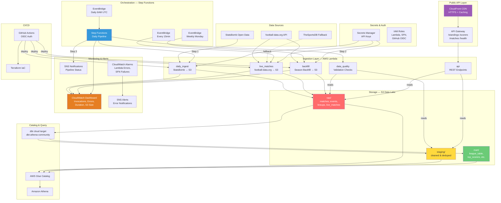

# AWS Cloud Architecture — EPL Pipeline

## Overview

The cloud layer extends the existing local DuckDB + Airflow pipeline to run on AWS, using a serverless architecture with S3 data lake, Lambda for ingestion, Glue Catalog for metadata, Athena for querying, Step Functions for orchestration, API Gateway + CloudFront for public API access, and CloudWatch for monitoring.

## Architecture Diagram



## Data Flow

### Medallion Architecture on S3

| Layer | S3 Prefix | Format | Description |
|-------|-----------|--------|-------------|
| **Raw** | `raw/` | Parquet | Immutable source data as ingested |
| **Staging** | `staging/` | Parquet | Cleaned, deduplicated, typed |
| **Mart** | `mart/` | Parquet | Business-ready aggregations |

### Lambda Functions

| Function | Trigger | Source | Description |
|----------|---------|--------|-------------|
| `daily_ingest` | Step Functions | StatsBomb | Full match, event, lineup ingestion |
| `live_matches` | Every 15 min (EventBridge) | football-data.org | Live/recent match scores |
| `backfill` | Weekly Monday (EventBridge) | football-data.org | Full season backfill |
| `data_quality` | Step Functions | S3 | Validates row counts, schema, nulls |
| `api` | API Gateway | S3 | Serves standings, scorers, matches, health |

### Step Functions Pipeline

The daily pipeline is orchestrated by Step Functions instead of direct EventBridge→Lambda:

1. **Daily Ingest** — Fetches matches, standings, and scorers from APIs → S3
2. **Data Quality Check** — Validates latest S3 objects (non-empty, valid JSON, expected keys)
3. **SNS Notification** — Sends success/failure notification with details

Includes retry logic (2 retries with exponential backoff) and error catching at each step.

### Public API (API Gateway + CloudFront)

| Endpoint | Description | Cache TTL |
|----------|-------------|-----------|
| `GET /standings` | Latest league standings from S3 | 5 min |
| `GET /scorers` | Top scorers from S3 | 5 min |
| `GET /matches` | Latest match data from S3 | 5 min |
| `GET /health` | Pipeline health + last run status | 1 min |

CloudFront provides HTTPS, caching, and is custom-domain-ready (add ACM cert).

### Monitoring & Alerts

| Component | Metrics |
|-----------|---------|
| **Dashboard** | Lambda invocations, errors, duration (avg/p99), S3 size, SFN status |
| **Alarms** | Lambda errors > 0, Step Function failures |
| **SNS Topics** | Pipeline notifications (success/fail), Alert notifications |

### Partitioning Strategy

- `raw/live_matches/` — Partitioned by `ingestion_date` (Hive-style: `ingestion_date=YYYY-MM-DD/`)
- `raw/matches/` — Partitioned by `season_id`
- `raw/events/` — Append-only with timestamp in filename

## AWS Resources

| Resource | Service | Purpose |
|----------|---------|---------|
| Data Lake Bucket | S3 | Parquet storage (versioned, encrypted) |
| Athena Results Bucket | S3 | Query result cache (7-day expiry) |
| Lambda Deploy Bucket | S3 | Function deployment packages |
| EPL Database | Glue Catalog | Schema-on-read metadata |
| EPL Workgroup | Athena | Query engine with cost controls |
| 5 Lambda Functions | Lambda | Ingestion, quality checks, API |
| Daily Pipeline | Step Functions | Orchestrated ingest + validation |
| 3 EventBridge Rules | EventBridge | SFN schedule, live matches, backfill |
| REST API | API Gateway | Public data endpoints |
| CDN Distribution | CloudFront | HTTPS, caching, custom domain ready |
| Pipeline Dashboard | CloudWatch | Operational visibility |
| 4 Alarms | CloudWatch | Error & failure detection |
| 2 SNS Topics | SNS | Alerts + pipeline notifications |
| API Keys Secret | Secrets Manager | football-data.org key |
| Lambda Exec Role | IAM | Least-privilege execution |
| SFN Exec Role | IAM | Step Functions permissions |
| EventBridge SFN Role | IAM | EventBridge→SFN trigger |
| GitHub OIDC Role | IAM | CI/CD without static keys |

## Local vs Cloud

The cloud layer is **additive** — the existing local pipeline continues to work unchanged:

| Capability | Local | Cloud |
|-----------|-------|-------|
| Storage | DuckDB | S3 + Parquet |
| Orchestration | Airflow | Step Functions + EventBridge |
| Ingestion | Python scripts | Lambda functions |
| Query Engine | DuckDB | Athena |
| dbt Target | `local` (DuckDB) | `cloud` (Athena) |
| Dashboard | Next.js (JSON files) | Next.js (JSON files) |
| Public API | Flask/FastAPI (local) | API Gateway + CloudFront |
| Monitoring | — | CloudWatch Dashboard + Alarms |

## Cost Estimate (Dev)

| Service | Monthly Estimate |
|---------|-----------------|
| Lambda (5 functions) | ~$0.75 (low invocations) |
| S3 | ~$0.50 (< 1 GB) |
| Athena | ~$0.25 (minimal queries) |
| Secrets Manager | $0.40 |
| Step Functions | ~$0.10 (free tier: 4,000 transitions/mo) |
| API Gateway | ~$0.10 (free tier: 1M calls/mo) |
| CloudFront | ~$0.10 (free tier: 1 TB/mo) |
| CloudWatch | ~$0.00 (free tier: 10 alarms, 3 dashboards) |
| SNS | ~$0.00 (free tier: 1M publishes) |
| EventBridge | Free tier |
| **Total** | **~$2.20/mo** |

## Setup

```bash
# 1. Bootstrap AWS (state bucket, DynamoDB lock table)
./scripts/setup_aws.sh

# 2. Deploy infrastructure
cd infra/terraform
terraform plan
terraform apply

# 3. Set API key
aws secretsmanager put-secret-value \
  --secret-id epl-pipeline/dev/api-keys \
  --secret-string '{"FOOTBALL_DATA_API_KEY":"your-key"}'

# 4. Deploy Lambda code
./scripts/deploy_lambdas.sh

# 5. Run dbt against cloud
cd dbt && dbt run --target cloud

# 6. Access the public API
terraform output cloudfront_url
# → https://d1234567890.cloudfront.net/standings
```
