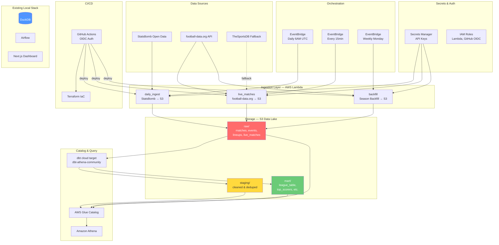

# AWS Cloud Architecture — EPL Pipeline

## Overview

The cloud layer extends the existing local DuckDB + Airflow pipeline to run on AWS, using a serverless architecture with S3 data lake, Lambda for ingestion, Glue Catalog for metadata, and Athena for querying.

## Architecture Diagram



## Data Flow

### Medallion Architecture on S3

| Layer | S3 Prefix | Format | Description |
|-------|-----------|--------|-------------|
| **Raw** | `raw/` | Parquet | Immutable source data as ingested |
| **Staging** | `staging/` | Parquet | Cleaned, deduplicated, typed |
| **Mart** | `mart/` | Parquet | Business-ready aggregations |

### Lambda Functions

| Function | Trigger | Source | Description |
|----------|---------|--------|-------------|
| `daily_ingest` | Daily 6 AM UTC | StatsBomb | Full match, event, lineup ingestion |
| `live_matches` | Every 15 min | football-data.org | Live/recent match scores |
| `backfill` | Weekly Monday | football-data.org | Full season backfill |

### Partitioning Strategy

- `raw/live_matches/` — Partitioned by `ingestion_date` (Hive-style: `ingestion_date=YYYY-MM-DD/`)
- `raw/matches/` — Partitioned by `season_id`
- `raw/events/` — Append-only with timestamp in filename

## AWS Resources

| Resource | Service | Purpose |
|----------|---------|---------|
| Data Lake Bucket | S3 | Parquet storage (versioned, encrypted) |
| Athena Results Bucket | S3 | Query result cache (7-day expiry) |
| Lambda Deploy Bucket | S3 | Function deployment packages |
| EPL Database | Glue Catalog | Schema-on-read metadata |
| EPL Workgroup | Athena | Query engine with cost controls |
| 3 Lambda Functions | Lambda | Serverless ingestion |
| 3 EventBridge Rules | EventBridge | Scheduled triggers |
| API Keys Secret | Secrets Manager | football-data.org key |
| Lambda Exec Role | IAM | Least-privilege execution |
| GitHub OIDC Role | IAM | CI/CD without static keys |

## Local vs Cloud

The cloud layer is **additive** — the existing local pipeline continues to work unchanged:

| Capability | Local | Cloud |
|-----------|-------|-------|
| Storage | DuckDB | S3 + Parquet |
| Orchestration | Airflow | EventBridge |
| Ingestion | Python scripts | Lambda functions |
| Query Engine | DuckDB | Athena |
| dbt Target | `local` (DuckDB) | `cloud` (Athena) |
| Dashboard | Next.js (JSON files) | Next.js (JSON files) |

## Cost Estimate (Dev)

| Service | Monthly Estimate |
|---------|-----------------|
| Lambda | ~$0.50 (low invocations) |
| S3 | ~$0.50 (< 1 GB) |
| Athena | ~$0.25 (minimal queries) |
| Secrets Manager | $0.40 |
| EventBridge | Free tier |
| **Total** | **~$1.65/mo** |

## Setup

```bash
# 1. Bootstrap AWS (state bucket, DynamoDB lock table)
./scripts/setup_aws.sh

# 2. Deploy infrastructure
cd infra/terraform
terraform plan
terraform apply

# 3. Set API key
aws secretsmanager put-secret-value \
  --secret-id epl-pipeline/dev/api-keys \
  --secret-string '{"FOOTBALL_DATA_API_KEY":"your-key"}'

# 4. Deploy Lambda code
./scripts/deploy_lambdas.sh

# 5. Run dbt against cloud
cd dbt && dbt run --target cloud
```
